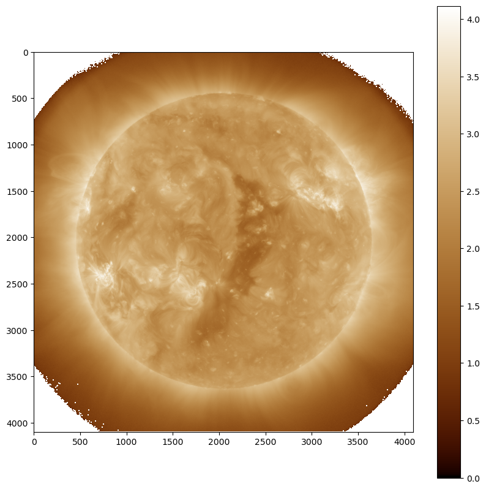

# SoS-ML4-Sun

This repository is a tutorial on application of k-means algorithm to segmentation of the solar images. We start by a simple examples of mall visitors dataset where the method is introduced. 



## Table of Contents

- [Introduction](#introduction)
- [Installation](#installation)
- [Usage](#usage)

## Introduction

The relevant lecture on Data Science can be downloaded from [Presentation](SoSDataScience.pdf)

The Jupyter Notebook document in this project showcases different examples and tutorials related to data analysis and machine learning. It covers topics such as data cleaning, exploratory data analysis, clustering algorithms, and more.

## Installation

To run the Jupyter Notebook document, you need to have Python and Jupyter Notebook installed on your machine. Follow these steps to set up the project:

1. Clone the repository to your local machine.
2. Install the required dependencies by running the following command in your terminal:
    ```
    pip install -r requirements.txt
    ```
3. Launch Jupyter Notebook by running the following command in your terminal:
    ```
    jupyter notebook
    ```
4. Open the Jupyter Notebook document (.ipynb file) in your browser.

5. From `summer_of_science_pt1.ipynb` you can learn how to use k-means algorithm

6. From `summer_of_science_pt2.ipynb` you can try applying the algorithm to solar images

## Usage

The Jupyter Notebook document is organized into cells, each containing code snippets or markdown content. You can execute each cell independently by clicking on it and pressing Shift + Enter. The code cells may rely on variables or modules defined in previous cells, so make sure to execute the cells in order.
